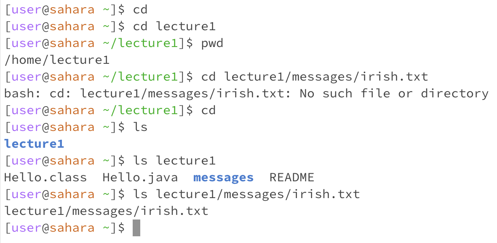
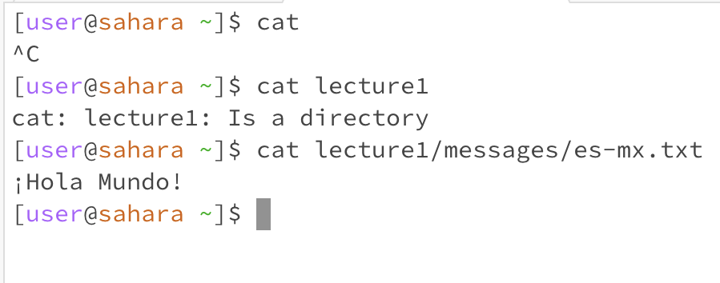

cd:

1) CD with no arguments: Running CD with no arguments returns you to the home directory from whatever directory you are currently in. If you are in the home directory already, you just won't go anywhere.
   
2) CD with directory path: The change directory command with a directory path will take you to the new directory you put in the command line. That is the point of the change directory command.
   
3) Because the change directory command is meant for directories / folders and not files, running the command with a path to a file will result in the default error message "No such file or directory." CD is a valid command only for directories.

ls:

1) The ls or list command shows information about various files or directories, depending on where you currently are in your environment. In the case of just ls with no arguments, the contents of the current directory will be displayed, in this case lecture1. If messages was not a subdirectory of lecture1 it would display both directories but because lecture1 is the only directory in the home directory that is all that is displayed when running ls with no arguments
   
2) ls lecture1 lists the contents of the lecture1 directory, including messages which is also a directory it is just inside the lecture1 directory.
   
3) Running ls with a path to a text file just displays the path to the text file because the purpose of ls is to display the contents of directories so when given a file path the command will just display that file, not it's contents. 

cat:

1) when running cat with no arguments you are prompted to type in the name of files so that the command can be used to display the content of said files after you type them in, but there is no actual output because the purpose of cat is to display the content of files and with no file path there is nothing to display.
   
2) running cat lecture1 throws an error because the purpose of cat is to read the content of files, not directories, and because lecture1 is a directory it is not able to read it and return it's contents.
   
3) running cat along with a path to a file will display the content of said file, in the photo cat is used to display the content of the "irish" text file which is the words Hello World in Irish.

