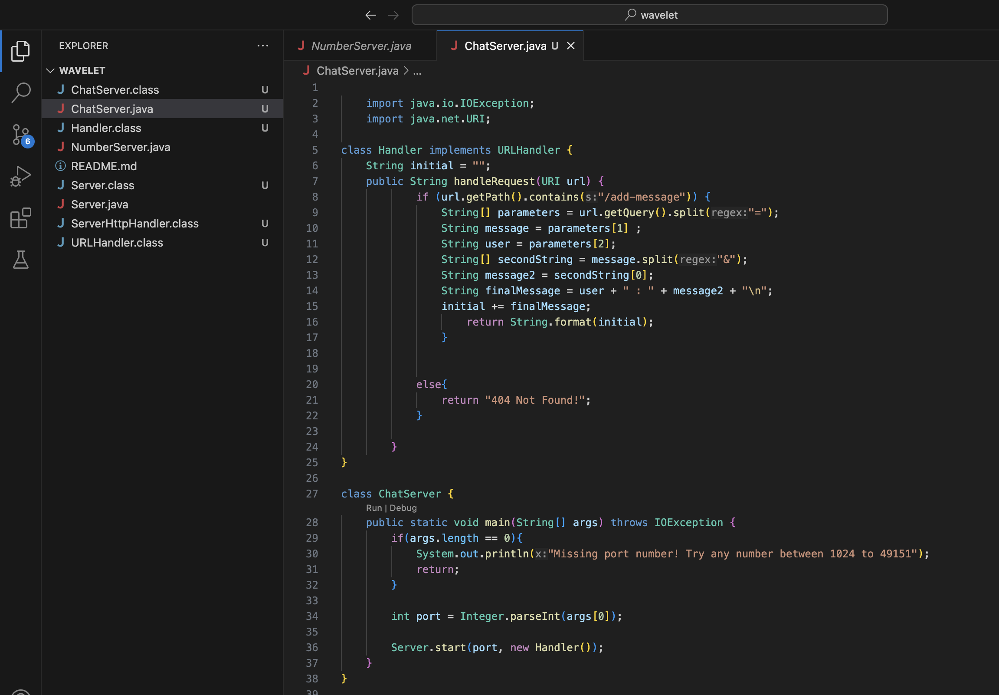
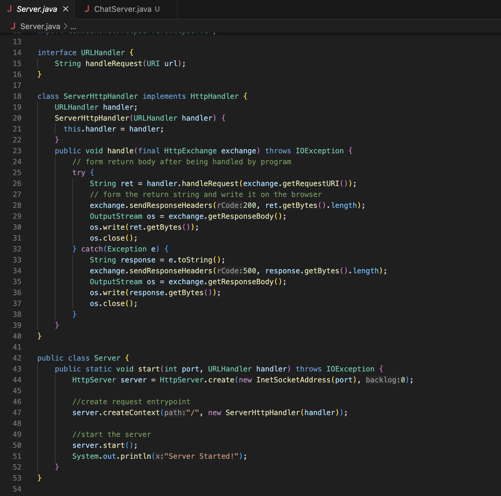
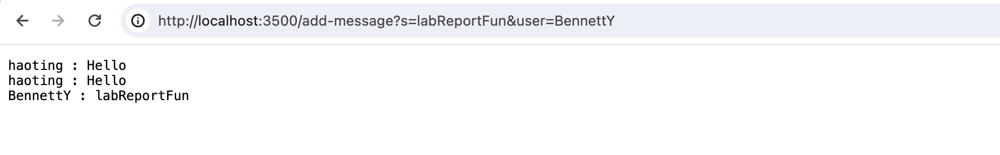
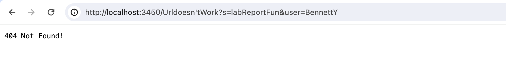
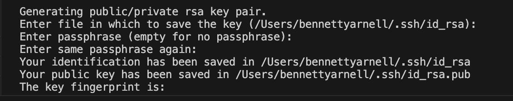
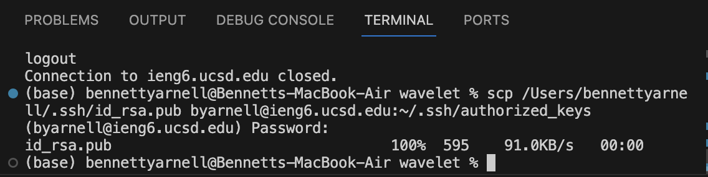

# Lab Report 2: Servers and SSH Keys
## Bennett Yarnell 


# Part 1


### Code for ChatServer:

Above is my implentation of the ```ChatServer``` class, which creates two String arrays of the contents of the URL and accesses these arrays to print accurate messages on the locally hosted web server.

### Code for Server:

Above is the implementation of Server which was discussed in Lab.

### Image 1 of ChatServer Running:


Above is how ```ChatServer``` behaves when given a correct URL and multiple entries. In this instance, the method ```handlerequest``` is called because ```/add-message``` is present in the URL. ```handlerequest``` turns the URL into string arrays and then access them, and then adds them to a master string so when entering different URLs the previous interactions are saved. (user: BennettY and user: haoting are an example of different URLs being entered and edited). 

The methods called in this method are:
```start```,  ```create```, ```createContext```, ```write```, ```close```, ```getRequestURI```, ```getResponseBody```, ```toString```, ```getBytes```, ```format```, ```parseInt```, ```getPath```, and ```getQuery```.
These methods are String methods, Integer Methods, HTTPServer Methods, URI methods, and other classes and interfaces from the Server class. 

In this image, the URL is ```https://localhost:3500/add-message?s=labReportFun&user=BennettY```. The port is obviously ```3500```. When I run ```ChatServer``` the first method call is to the ```start``` method in the ```Server``` class and then a series of method calls and object creatuons result in a server using the 3500 port and the printing of ```Server Started!." Then I enter the rest of the URL into the browser, and the code recognizes the presence of the "/add-message" string which starts the first  ```if``` condition of ```handlerequest``` which then creates and manipulates String arrays as mentioned above. 

The values which were changed in each entering of a new URL was the value of ```initial``` which is the master string which gets concatenated with the new content from the URL


### Image 2 of ChatServer Running:


Above is how ```ChatServer``` behaves when it is given a URL which does not have the substring ```addmessage``` inside it. In this case, the if condition in ```handlerequest``` is passed over and the else returns the string ```404 Not Found!```.

In this instance all of the above explanations about what happens in the ```Server``` class hold true except the port number has changed to be ```4000``` instead of ```3500```. But, because the ```handlerequest``` method does not detect ```/add-message``` the text displayed on the server is ```404 Not Found!```.

# Part 2





The path to my public key is ```~/.ssh/id_rsa.pub``` and the path to my private key is ```~/.ssh/id_rsa```


# Part 3

I learned everything I know about directories, folders, terminal commands, local hosts, secure shells, and URLs these past two weeks. I would say that for me personally the most interesting thing I've learn so far is how to create and edit web servers using getQuery and getPath and having information displayed on your own locally hosted website. 


