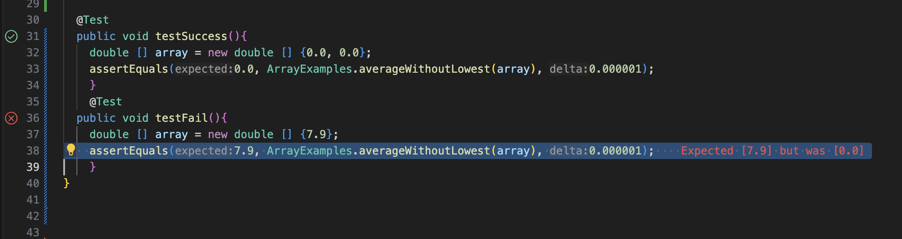

# Lab Report 3: Bugs and Commands
## Bennett Yarnell 


# Part 1

## Failure Inducing Input

```
@Test
public void testReverseInPlaceFailure() {
    int[] arr = {1, 2, 3, 4};
    ArrayExamples.reverseInPlace(arr);
    assertArrayEquals(new int[]{4, 3, 2, 1}, arr); 

```
This test failed, with the following result: ``` Expected [2] but was [3] ```. This indicates there is a bug in the methods handling of arrays. Looking at the method, it's clear that because the method tries to swap every entry in the array all in one loop that swapped entries will get overwritten 

## Non Failing Input

```
@Test
public void testReverseInPlaceWithSingleElement() {
    int[] arr = {1};
    ArrayExamples.reverseInPlace(arr);
    assertArrayEquals(new int[]{1}, arr);
}

```
This test will pass because it does not contain enough elements for the flawed logic to become a problem, nothing gets overwritten or incorrectly changed, or even really swapped, because there is no element to take the place of ```1```.

## Symptom (Test failure and Test success)

Above is the test which has a non zero value as the higher of two numbers failing the test, and a test which has two zero values passing the test.

## Image of Code (Bug Included)

Above is the code which has a bug from Lab 4. The bug is that the code, if given two numbers, removes one number correctly, but does not correctly assignt the average to be equal to the only remaining value, but instead the value ```0.0```.

## Image of Debugged Code

This code should work as intended, as I've removed the hardcoded return value of 0.0 and replaced it with the value stored in ```arr[0]```, the only value in the array. 

# Part 2

## Command Line uses of the Find Command

### find . -type

This command finds all files or directories within the current working directory of the given type

The ```find . -type d``` command finds all the directories in the current working directory which is ```technical```. The output of the ```find . -type d``` command is: 
```.
./government
./government/About_LSC
./government/Env_Prot_Agen
./government/Alcohol_Problems
./government/Gen_Account_Office
./government/Post_Rate_Comm
./government/Media
./plos
./biomed
./911report
```

The ```find . type f``` command finds all the files in the current working directory. I switched into the ```911report``` directory to save space and not show all the files displayed in technical.

```./chapter-13.4.txt
./chapter-13.5.txt
./chapter-13.1.txt
./chapter-13.2.txt
./chapter-13.3.txt
./chapter-3.txt
./chapter-2.txt
./chapter-1.txt
./chapter-5.txt
./chapter-6.txt
./chapter-7.txt
./chapter-9.txt
./chapter-8.txt
./preface.txt
./chapter-12.txt
./chapter-10.txt
./chapter-11.txt
```
### find . -name

This command finds the path to a given file or directory. 

The command:
```
find .- name "chapter12.txt"
```
finds and loads the path to the chapter12.txt file. 

The output is:
```
./technical/911report/chapter-12.txt
```

The command:
```
find . -type d -name "biomed"
``` 
uses the ```find . -name``` command while using the command above to specify I am looking for directories, not files. The output is the path to the biomed directory:
```
./technical/biomed
```

### find . -mtime

This command finds all files or directories modified in a certain amount of time.

The command: 
```
find . -type d -mtime -5
```
finds all the directories  in the current working directory ```technical``` which have been modified in less than five days ago. The output is:
```
.
./government
./government/About_LSC
./government/Env_Prot_Agen
./government/Alcohol_Problems
./government/Gen_Account_Office
./government/Post_Rate_Comm
./government/Media
./plos
./biomed
./911report
```

The command 
```
find . -type f -mtime -5
```
finds all the files in the current working directory ```911reports``` which have been modified less than five days ago. The output is:
```
./chapter-13.4.txt
./chapter-13.5.txt
./chapter-13.1.txt
./chapter-13.2.txt
./chapter-13.3.txt
./chapter-3.txt
./chapter-2.txt
./chapter-1.txt
./chapter-5.txt
./chapter-6.txt
./chapter-7.txt
./chapter-9.txt
./chapter-8.txt
./preface.txt
./chapter-12.txt
./chapter-10.txt
./chapter-11.txt
```

### find . -perm 755

This command finds all files or directories which have the common permission number 755 which means each of these groups can do these things:  ```owner read/write/execute, group read/execute, others read/execute```. 

The command 
```
find . -type d -perm 755
``` 
finds all directories with these persmission settings in the current working directory, which is ```docsearch```. The output is:
```
.
./lib
./.git
./.git/objects
./.git/objects/pack
./.git/objects/info
./.git/info
./.git/logs
./.git/logs/refs
./.git/logs/refs/heads
./.git/logs/refs/remotes
./.git/logs/refs/remotes/origin
./.git/hooks
./.git/refs
./.git/refs/heads
./.git/refs/tags
./.git/refs/remotes
./.git/refs/remotes/origin
./technical
./technical/government
./technical/government/About_LSC
./technical/government/Env_Prot_Agen
./technical/government/Alcohol_Problems
./technical/government/Gen_Account_Office
./technical/government/Post_Rate_Comm
./technical/government/Media
./technical/plos
./technical/biomed
./technical/911report
```

The command
```
find . -type f -perm 755
```
finds all the files with these permission settings in the ```911report``` directory. The output is:

```
./chapter-13.4.txt
./chapter-13.5.txt
./chapter-13.1.txt
./chapter-13.2.txt
./chapter-13.3.txt
./chapter-3.txt
./chapter-2.txt
./chapter-1.txt
./chapter-5.txt
./chapter-6.txt
./chapter-7.txt
./chapter-9.txt
./chapter-8.txt
./preface.txt
./chapter-12.txt
./chapter-10.txt
./chapter-11.txt
```
## Works Cited

For this assignment I used one Chat GPT prompt, and used it's output:
Prompt: ```"four somewhat standard ways to use to find command"```
Output: 
```
The find command in Unix-like operating systems is incredibly versatile and can be used for a wide range of tasks related to searching for files and directories based on various criteria. Here are four standard ways to use the find command:

Search Files by Name: To find files with a specific name in a directory and its subdirectories, you can use the -name option. For example, to find all files named example.txt under the current directory, you would use:

find . -name "example.txt"

Search Files by Type: The find command can search for files of a specific type using the -type option. For example, to find all directories (type d) under the current directory, you would use:

find . -type d

Search Files by Modification Time: To find files modified within a certain time frame, you can use the -mtime option. For example, to find files modified in the last 7 days, you would use:

find . -mtime -7

Execute Commands on Found Files: The -exec option allows you to execute a command on each file found by find. For example, to find all .txt files and count the number of lines in each, you can use:

find . -name "*.txt" -exec wc -l {} \;

These examples demonstrate some of the most common and useful ways to utilize the find command for finding files and directories based on name, type, modification time, and for executing commands on the files found.
```
I used this output for three of my four unique untilizations of the find command which I was supposed to find online. I changed them by tailoring them to the ```technical``` directory and using the specific commands on different files and direcorties in the terminal of my local machine. 

I also cited IBM's documentation of the find command to find additonal information. Linked below

```
https://www.ibm.com/docs/en/aix/7.1?topic=files-finding-find-command
``` 


