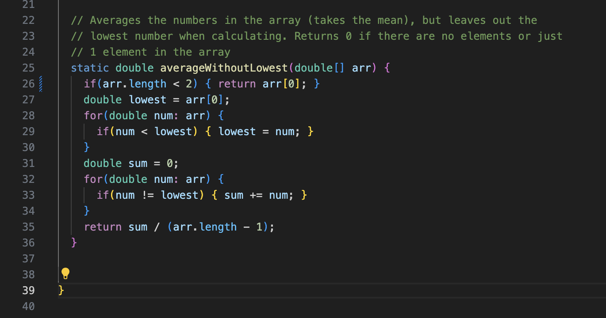

# Lab Report 3: Bugs and Commands
## Bennett Yarnell 


# Part 1

## Failure Inducing Input

```
@Test
  public void testFailure(){
    double [] array = new double [] {7.9};
    assertEquals(7.9, ArrayExamples.averageWithoutLowest(array), 0.000001);
    }
```

## Non Failing Input

```
@Test
  public void testSuccess(){
    double [] array = new double [] {0.0, 0.0};
    assertEquals(0.0, ArrayExamples.averageWithoutLowest(array), 0.000001);
    }
```
## Symptom (Test failure and Test success)

Above is the test which has a non zero value as the higher of two numbers failing the test, and a test which has two zero values passing the test.

## Image of Code (Bug Included)

Above is the code which has a bug from Lab 4. The bug is that the code, if given two numbers, removes one number correctly, but does not correctly assignt the average to be equal to the only remaining value, but instead the value ```0.0```.

## Image of Debugged Code

This code should work as intended, as I've removed the hardcoded return value of 0.0 and replaced it with the value stored in ```arr[0]```, the only value in the array. 

# Part 2


