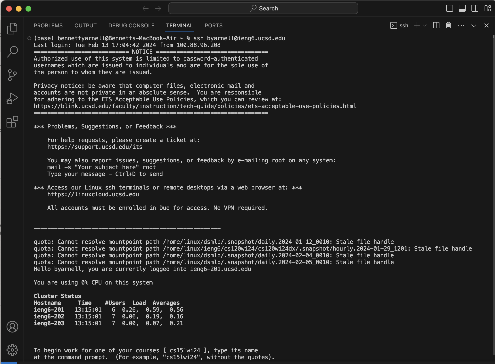
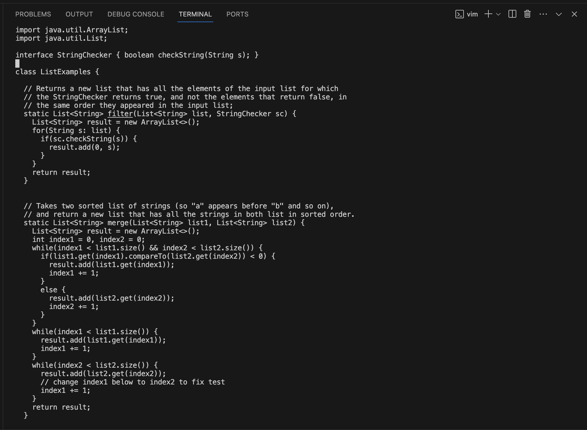

# Lab Report 3: Vim
## Bennett Yarnell 


## Step 1


Keys Pressed: ```ssh <space> byarnell@ieng6.ucsd.edu <enter>```

This step involves using ```ssh`` command to create a SSH client which connects to a remote server. ```byarnell``` is my username on the server, and ```@ieng6.ucsd.edu``` is the name of the server.

## Step 2


Keys Pressed: ```git <space> clone <space> <ctrl c> <ctrv> <enter>'''

This step involves cloning the fork which I created in step 2 (not shown). I do this using the ```ssh url`` which I created by generating an SSH key for Github. 

## Step 3


Keys Pressed: ```ls <enter> cd lab7 <enter> bash test.sh``` 

I took more steps than necessary in order to do these steps because I am in the habit of checking what files are present in my directory using ```ls```. After this I used ```cd lab7``` to enter the ``lab7`` directory. Then I used the ```bash test.sh``` command to run the bash script containing the tests.

## Step 4




Keys Pressed: ```vim ListExamples.java <enter> 43j <enter> 3e <enter> x i 2 esc :wq <enter>```

This step involves using ```vim``` to edit the file so the tests run correctly. I used ```vime <filename>``` to enter the file, and then used ```<line number> j``` to jump the correct line number, and then used <word number> e to jump to the end of the third word. Then I used ```x``` to delete the 1 and entered ```insert mode``` using ```i``` then I changed the 1 to a 2 and pressed ```esc``` and then saved and exited using ``` :wq ```
