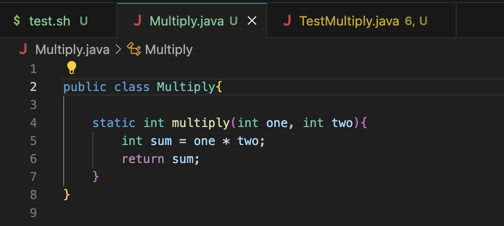
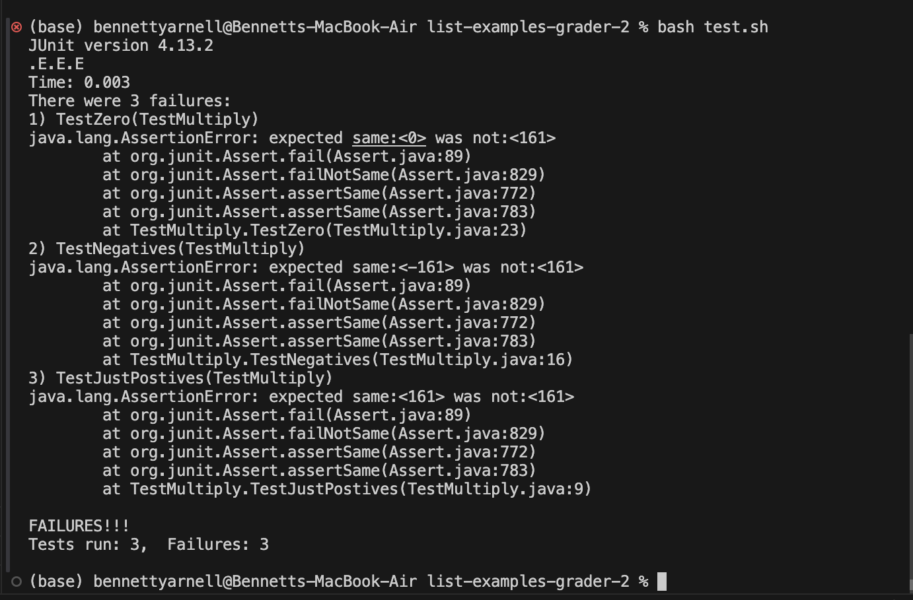
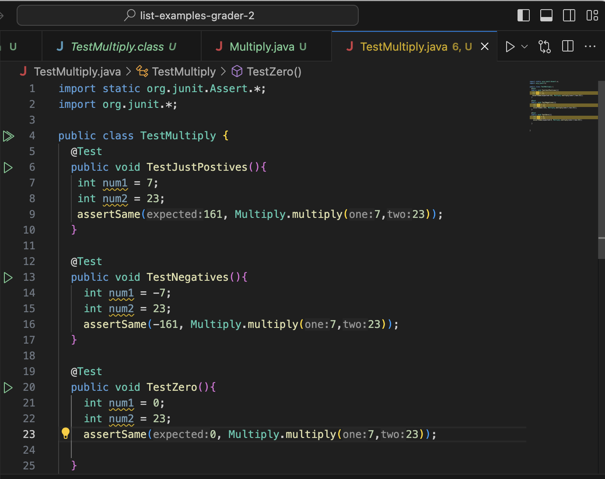
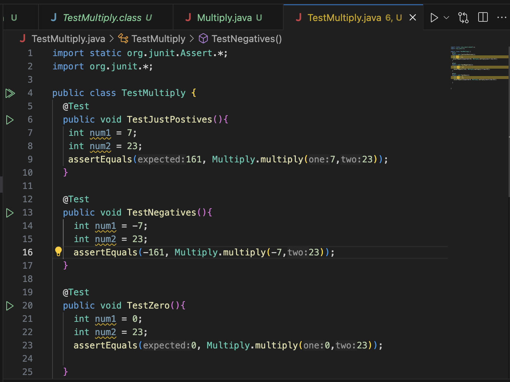
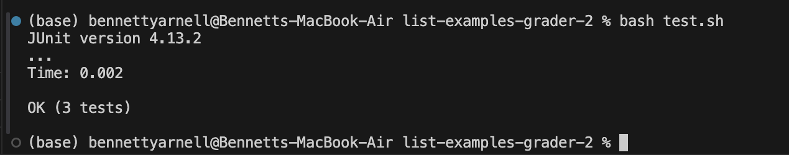
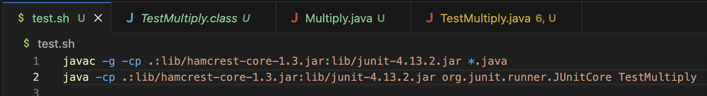

# Lab Report 5: Putting It All Together
## Bennett Yarnell 


## Step 1

```
Anonymous Student: Hello! I am currently implementing the multiply method for the most recent PA,
and I really don't understand why I'm failing this test.
The test itself even says the two things are equal for some of them!!
Am I doing something wrong or is it my computer???
I have attached multiple screenshots. Please help!
```







## Step 2

```
Anonymous TA: Hello! I don't want to answer your question with nothing but the correct code.
You won't learning anything if I do! But I will say your implementation of the multiply method looks
similiar to what was talked about in lecture. Your method is definitely doing arithmetic.
I would highly recommend taking a closer look at your test methods, and take a look
at how the professor wrote his tests in Lecture 4!
Specifically, what is the difference between assertSame and
asssertEquals? Start early start often!
```

## Step 3

```
Anonymous Student: Aha! It turns out the assert statement I'm using in my test, the
assertSame statement, checks whether the expected and the actual fields are pointing
to the same object in memory, not that they have the same value. I also had an incorrect
arithmetic assumption in my first and second test. 
I have correctly updated my test class to reflect this change:
```





## Step 4

### File and Directory Structure
The ```test.sh``` file and the ```Mutiply.java``` file and the ```TestMultiply.java``` file are all in the ```list-examples-grader-2``` directory. The student is responsible for editing the file.

### Pre Bug-Fix Files


### Command Line Information
To run the test which triggered the bug I ran `bash test.sh` which triggered this bash script to run the buggy test file:


I then used the command `vim TestMultiply.java` to enter the file and used the `h` `j` `k` and `l` keys to move around in the file. I used `x` and `i` to delete and insert.

### What To Edit
The `TestMultiply.java` file uses an assert statement meant to compare if two objects are the same, meaning they point to the same place in memory. In this case, the actual `multiply` method
works with the primitive type `int ` only, and does not even return an object. Because the method is built to use `int` and not `Integer`, you get a somewhat confusing error message which I thought was interesting because
your not actually told anything about objects, just that the test expected a number and didn't get it. In reality, in the `testJustPostives` test method for example, the error is same that the `Integer` object 161 does not point to the same place in memory as the 
`int` 161. This is the same in the other test cases. Fixing this requires changing the assert statement from ```assertSame``` to ```assertEquals```, because ```assertEquals``` deals with values not locations. 
There is also a error in the third test case where the numbers in the method call, when multiplied together, would not actually give the expected value. This was also changed by the student. 

# Part 2
Throughout the second half of this quarter, I had the opportunity to explore several intriguing applications of `git` commands: `git add`, `git commit`, and `git push`. I thought the application of `git` in general was very cool and answered a lot of questions I had, because before this class I could not have told you the difference between `git` and Github.  
This exploration not only deepened my understanding of version control systems but also illuminated the broader impacts of these commands on collaborative coding practices like the one in lab, and I think some interesting potential for future career aspirations like project management. 
Specifically, I thought one of the coolest applications I discovered was using these `git` commands when working on a group project to develop a chat server. We utilized `git add` to stage our individual contributions for commits. This allowed us to selectively add new features or bug fixes to our project's repository. I thought the collaborative nature of this gave me some insight into how large tech companies function. We then used `git commit` to save these staged changes, providing a descriptive message for each commit to document what was added or fixed. Finally, `git push` enabled us to upload our local commits to the remote repository, making our changes accessible to other team members.
This again made it clearer to me how someone who works in tech might actually function as one member of a giant entity. 


